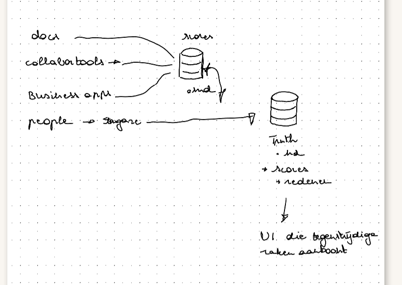
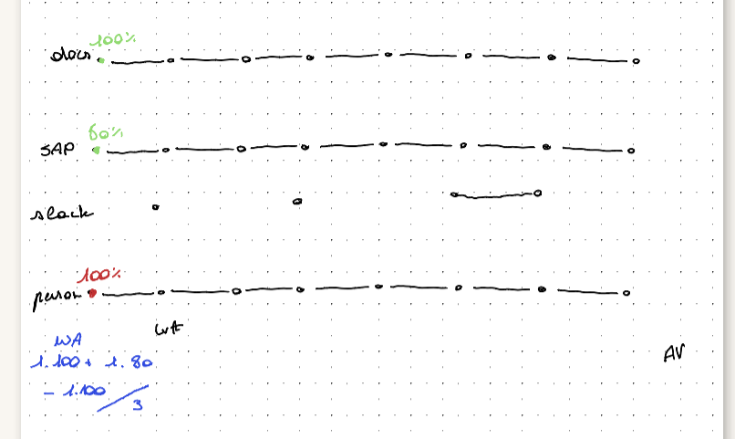
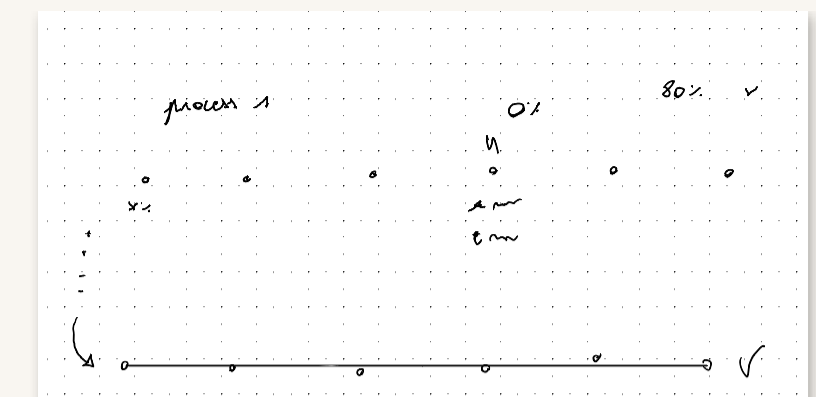

# TruthMap: knowledge quality management (Tectonic Hackathon · SD Worx case)

**Where do docs, business apps, chats and people disagree about how a process should run, and how much can you trust each step?**

TruthMap compares what every knowledge source says about each step of a business process, scores every step on **objective signals**, and explains every score. Steps you can trust form an **optimal process**; the rest are routed to the human who can decide. See [CONCEPT.md](CONCEPT.md) for the full concept and scoring model.

## Run it

```bash
cd app
npm install
npm run dev      # http://localhost:5173
npm test         # scoring engine tests
```

## How the score works (short)
1. **Per source:** 5 objective signals (designated source · formally approved · recency · reviewed in last 12 months · owner still active). Equal weights by default; adjustable in the UI ("the signals are facts, the weights are policy").
2. **Filters:** sources for another country are excluded. Every agreeing source raises confidence; a source that repeats another one adds half the bonus of an independent confirmation.
3. **Per step:** score = agreement × strength. Contested steps (a competing value ≥ 50% of the leading weight) are capped at 45% and go to a human; practice without an approved document or system of record is capped at 70%.
4. **Per process:** criticality-weighted average; any red critical step means "not release-ready".
5. **Human in the loop:** a quality manager resolves a conflict → the decision becomes evidence and the scores update live.

## Data
All data in `data/` is **synthetic** (fictional client, people and figures). No real or confidential data is used.
- `data/bank-account-change`: an employee changes their salary bank account (7 steps, 20 sources, raw files in `raw/`), the main demo
- `data/offboarding`: offboarding of a senior employee (8 steps, 19 sources)

Product architecture: see [ARCHITECTURE.md](ARCHITECTURE.md).

## What is simulated / unfinished
- **Connectors** (SharePoint, Confluence, SAP SuccessFactors, Slack, Teams, Outlook) are simulated with exported JSON.
- **AI extraction** (source → claims with a verbatim quote) is pre-computed in `claims.json`; tests check that every quote literally appears in its source.
- **StarGaze** people capture is represented by consented statements/recordings as sources.
- The app runs fully client-side (no backend, no accounts, no secrets). A production version would add SSO and role-based access.

## Portal & recorder

### Workspaces

| Folder         | What it is                                                                 |
| -------------- | -------------------------------------------------------------------------- |
| `portal/`      | Payroll workspace for the dummy client **Lumina Retail NV**: employee list → employee detail → "Edit IBAN" pop-up. Tracks every click and input. |
| `recorder/`    | Universal event recorder for any web page: `Recorder.start()` / `Recorder.stop()`. See [recorder/README.md](recorder/README.md). |
| `detection/`   | The trust-signal algorithm. See [detection/README.md](detection/README.md). |
| `events/`      | One `.jsonl` file per browser session with every tracked UI event. Format: [EVENTS.md](EVENTS.md). |
| `submissions/` | One JSON file per accepted IBAN change, linked to its events by `case_id`. |

### Run the portal

Needs Node 20+. No external dependencies.

```sh
npm install      # links the workspaces
npm start        # http://127.0.0.1:3000
npm test         # detection tests
```

Use "Signed in as" to act as a senior (Marie, Karim, Lotte) or a junior (Sam). Valid test IBAN: `BE71 0961 2345 6769`.

The server only listens on localhost. All data is synthetic.




